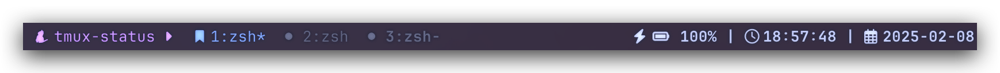
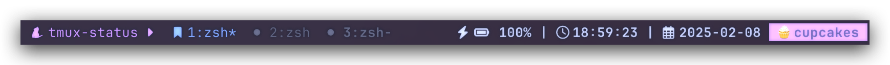
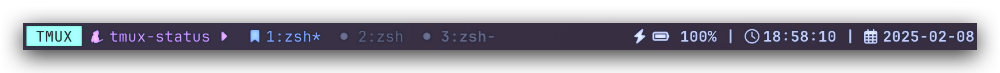

# My TMUX Status Bar



## Installation

### Installation with [Tmux Plugin Manager](https://github.com/tmux-plugins/tpm)

Add the following to your `tmux.conf` file:

```shellsession
$ set -g @plugin 'john0227/tmux_status'
```

### Manual Installation

Clone this repository and add the following to your `tmux.conf` file:

```shellsession
$ git clone https://github.com/john0227/tmux_status.git ~/.tmux/plugins/tmux_status
$ run-shell ~/.tmux/plugins/tmux_status/status.tmux
$ tmux source-file ~/.tmux.conf  # reload tmux.conf file
```

## Options

The following are the list of configurable options with their default values:

| Option                      | Default             |
| --------------------------- | ------------------- |
| @status_session_icon        |                    |
| @status_session_separator   |                    |
| @status_current_window_icon |                    |
| @status_window_icon         |                    |
| @status_right_separator     | `\|`                |
| @status_time_icon           |                    |
| @status_time_format         | `%T`                |
| @status_date_icon           |                    |
| @status_date_format         | `%F`                |
| @status_right_plugins       | `battery,time,date` |
| @status_right_custom        | N/A                 |
| @status_mode_indicator      | off                 |

### `@status_right_plugins`

In order to add custom plugins,

1. Add your custom script to the `scripts` folder of this plugin
2. Add the name of your script to the `@status_right_plugins` option (separated by one comma)
    - The order of `@status_right_plugins` option matters  
      Plugins will be added in the same order as stated in the option from left to right  

      e.g.) With the default value, the right status will be `BATTERY | TIME | DATE`

> [!NOTE]  
> The name of the script must match the name that appears in the `@status_right_plugins` option  
>   
> For example,  
> if you add a script with the name `my_script.sh`, you should add `my_script` to the `@status_right_plugins` option

### `@status_right_custom`



You can add whatever you want to display on your tmux status bar by setting the `@status_right_custom` option.
For example, the following was used to get the status bar shown above:

```shellsession
$ tmux set -g @status_right_custom " #[fg=black,bg=#c6a0f6]🧁cupcakes "
```

## Plugin Support

**[Tmux Mode Indicator](https://github.com/MunifTanjim/tmux-mode-indicator)**



Add the following to your `tmux.conf` file:

```shellsession
$ # Add plugin
$ set -g @plugin 'MunifTanjim/tmux-mode-indicator'
$ # Set mode indicator option on
$ set -g @status_mode_indicator "on"
```

> [!NOTE]  
> Make sure this plugin is loaded BEFORE `tmux-mode-indicator`
